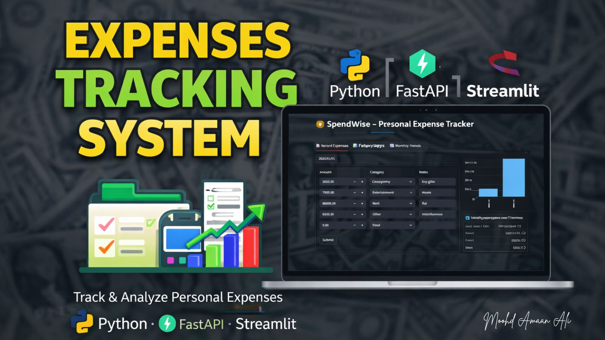

# 💰SpendWise – Personal Expense Tracker

This Project is a **Personal Expense Tracker** developed as part of my **Data Science learning journey**.  
The main goal is to collect, organize, and analyze expense data while building a simple end-to-end data-driven application.
The system uses **FastAPI** to handle data through APIs and **Streamlit** to present insights in an interactive way.

<p align="center">
  
</p>

---

## 🎯 Project Objective

- Store and manage daily expense data
- Perform basic analysis on expenses
- Understand real-world data flow (data → API → visualization).
- Practice building data-centric applications using Python

---

## 🧠 Data Science Perspective

From a data science point of view, this project focuses on:

- Data collection through APIs  
- Data validation and preprocessing  
- Generating summaries and insights from expense data  
- Displaying results using simple visual and interactive components.

---

## 🛠 Tech Stack

- **Python**
- **FastAPI** – Backend APIs for data handling
- **Streamlit** – Interactive frontend for data display
- **PyTest** – Basic testing
- **REST APIs**

---


## 📁 Project Structure

- **frontend/**: Streamlit UI for displaying data.
- **backend/**: FastAPI server for expense data.
- **tests/**: Contains the test cases for both frontend and backend.
- **requirements.txt**: Project dependencies.
- **README.md**: Project documentation.

---

## ⚙️ Setup Instructions

**1️⃣ Clone the Repository:**
   ```bash
   git clone https://github.com/Amaan4li/expense-tracker.git
   cd expense-tracker
   ```
**2️⃣ Install Dependencies:** 
   ```commandline
    pip install -r requirements.txt
   ```
**3️⃣ Run Backend Server:**
   ```commandline
    uvicorn server.server:app --reload
   ```
**4️⃣ Run Frontend Application:** 
   ```commandline
    streamlit run frontend/app.py
   ```

---

### 📊 Learning Outcomes
**Through this project, I learned:**
- How to collect and manage structured data.
- Basic data cleaning and validation techniques.
- Creating APIs to serve data for analysis.
- Connecting backend data processing with frontend visualization
- Structuring a data-focused Python project.
- Applying programming concepts to real-world data problems.

---

## 📬 Connect with Me
**If you have any feedback or would like to collaborate, feel free to reach out!** <br>
🔗 LinkedIn: [amaan-ali-ds](https://www.linkedin.com/in/amaan-ali-ds) <br>
🔗Live App: [link](https://tracker-fpseqsczkkgyyljcfwegvl.streamlit.app/)


